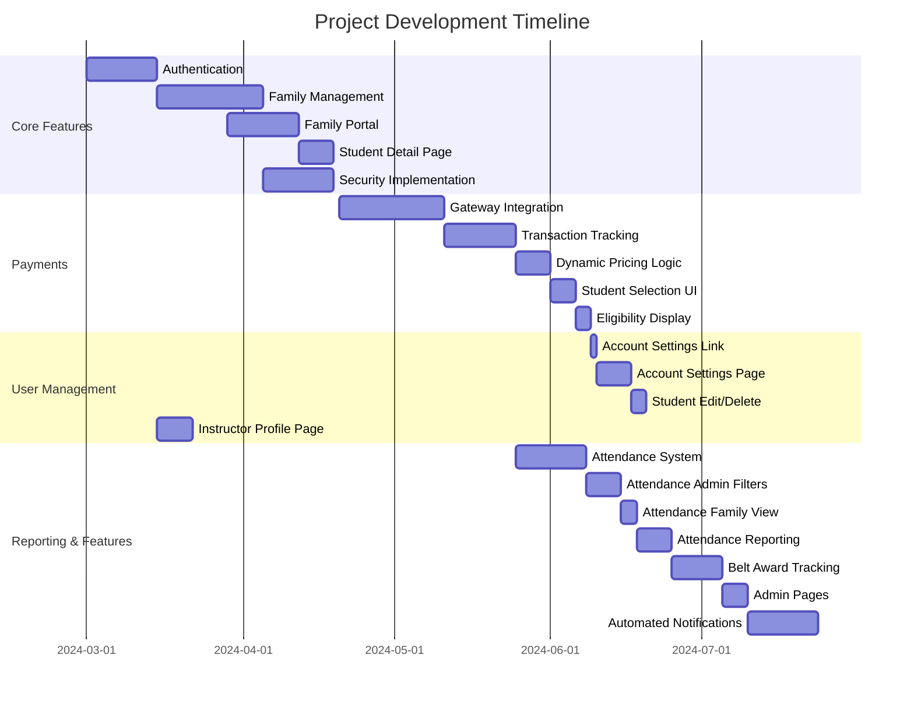

# Karate Class Website

## Project Overview

Develop a comprehensive and user-friendly karate class management website for 
Sensei Negin's classes (details managed in `app/config/site.ts`), 
incorporating efficient family-oriented registration, 
achievement tracking, attendance monitoring, payment integration, and waiver management.

## Features

### Core User Experience
- **Public Pages:**
    - Home Page: Introduction, class schedule, location (`app/config/site.ts`).
    - Instructor Profile (`/about`): Bio for Sensei Negin.
    - Contact Page (`/contact`).
- **Authentication:** Secure user registration, login, email confirmation, and password management.
- **Family Portal (`/family`):** Central dashboard for logged-in users.
    - View associated family details.
    - List registered students with links to individual pages.
    - Manage family/guardian information and change password (`/family/account`).
    - View student attendance history (`/family/attendance`).
    - Track required waiver signature status.
- **Student Management (Family View):**
    - View detailed student information (`/family/student/:studentId`).
    - Edit student details.
    - *Note: Student deletion might be restricted to Admins.*
- **Waiver Management:** Digitally sign required waivers (Liability, Code of Conduct, Photo/Video, Payment/Dress Code).
- **Payments:**
    - Secure payment processing (Stripe integration planned/configured).
    - View payment history (Placeholder).
    - Dynamic pricing tiers based on student payment history (1st Month, 2nd Month, Ongoing).
    - Student eligibility status ("Trial", "Active", "Expired") based on payment history (`app/utils/supabase.server.ts`).

### Administrative Panel (`/admin`)
- **Dashboard:** Overview statistics (Families, Students, Payments, Attendance, Waivers).
- **Family Management:**
    - View all families (`/admin/families`).
    - Register new families (`/admin/families/new`).
    - View/Edit family details, guardians, and associated students (`/admin/families/:familyId`).
    - Edit guardian details (`/admin/families/:familyId/guardians/edit`).
    - Add new students to a family (`/admin/families/:familyId/students/new`).
- **Student Management:**
    - View all students (`/admin/students`).
    - View/Edit individual student details (`/admin/students/:studentId`).
    - Manage student belt awards (promotions) (`/admin/student-belts/:studentId`).
    - Delete students (available on family detail page `/admin/families/:familyId`).
- **Attendance Tracking:**
    - Record daily attendance (`/admin/attendance/record`).
    - View attendance history with filtering (`/admin/attendance`).
    - View attendance reports with rates (`/admin/attendance/report`).
- **Waiver Management:**
    - View/Edit waiver documents (`/admin/waivers`, `/admin/waivers/:waiverId`).
    - Mark waivers as required, triggering notifications.
    - View report of families/students with missing required waivers (`/admin/waivers/missing`).
- **Payment Management:**
    - Record manual payments (`/admin/payments/new`).
    - View pending payments (e.g., from failed online transactions) (`/admin/payments/pending`).
    - *Note: Full payment history/reporting might be a future enhancement.*

### Automated Notifications
- **Student Absence:** Email to family when student marked absent.
- **Newly Required Waiver:** Email to families needing to sign a newly required waiver.
- **Payment Reminder (Scheduled):** Supabase Edge Function (`payment-reminder`) emails families with 'Expired' student eligibility.
- **Missing Waiver Reminder (Scheduled):** Supabase Edge Function (`missing-waiver-reminder`) emails families missing required signatures.

### Technical & SEO
- Built with Remix for SSR and performance.
- Uses Supabase for backend (database, auth, edge functions).
- UI components from Shadcn.
- Mobile-optimized responsive design.
- Production-ready security headers (CSP, HSTS).
- SEO enhancements: Meta tags, `robots.txt`, dynamic `sitemap.xml`, JSON-LD structured data, canonical URLs.

## Technology Stack

- **Frontend**: Remix framework for optimal user experience, server-side rendering, and modern web practices.
- **Backend**: Supabase for scalable database solutions, authentication, and real-time functionalities.
- **UI Library**: Shadcn for clean, modern, and consistent UI components ensuring high usability.
- **Payments**: Stripe or PayPal integration for robust payment processing.
- **Deployment**: Cloud-based deployment solutions (e.g., Vercel or Netlify).

## Setup Instructions

### Supabase Configuration

#### Local Development:
1. Create a Supabase project at https://supabase.com
2. Enable Email auth provider in Authentication settings
3. Create tables following the database schema from the code
4. Get credentials:
   - `SUPABASE_URL`
   - `SUPABASE_ANON_KEY`
   - `SUPABASE_SERVICE_ROLE_KEY`

#### Vercel Deployment:
1. Add environment variables in Vercel:
   - `SUPABASE_URL`
   - `SUPABASE_ANON_KEY` 
   - `SUPABASE_SERVICE_ROLE_KEY`

### Stripe Configuration

#### Local Development:
1. Create Stripe account at https://stripe.com
2. Get API keys:
   - `STRIPE_SECRET_KEY`
   - `STRIPE_PUBLISHABLE_KEY`
3. Set webhook secret in `.env`:
   - `STRIPE_WEBHOOK_SECRET`

#### Vercel Deployment:
1. Add Stripe environment variables:
   - `STRIPE_SECRET_KEY`
   - `STRIPE_PUBLISHABLE_KEY`
   - `STRIPE_WEBHOOK_SECRET`
2. Configure webhook endpoint in Stripe Dashboard to point to your Vercel domain

### Resend Configuration

#### Local Development:
1. Create account at https://resend.com
2. Get API key:
   - `RESEND_API_KEY`
3. Set from email in `.env`:
   - `FROM_EMAIL` (format: "Name <email@domain.com>")

#### Vercel Deployment:
1. Add Resend environment variables:
   - `RESEND_API_KEY`
   - `FROM_EMAIL`
2. Verify sending domain in Resend dashboard

### General Setup

1. Clone repository
2. Install dependencies:
   ```bash
   npm install
   ```
3. Copy `.env.example` to `.env` and fill in values
4. Generate Supabase types:
   ```bash
   npx supabase gen types typescript --project-id YOUR_PROJECT_ID --schema public > supabase/functions/_shared/database.types.ts
   ```
5. Deploy Supabase functions:
   ```bash
   npx supabase functions deploy payment-reminder --no-verify-jwt
   npx supabase functions deploy missing-waiver-reminder --no-verify-jwt
   ```

## Development Timeline

- Week 1-2:

    - Project setup, database schema design, and initial configuration.
    - User authentication and basic registration functionalities.

- Week 3-4:
  - Homepage and instructor profile page development.
  - Development of detailed family and student registration forms.
  - Payment integration setup and testing.

- Week 5-6:
    - Attendance and achievement tracking systems implementation.
    - Admin dashboard creation.
    - Additional informational and policy pages setup.

- Week 7:

    - Waivers management system integration.
    - Initial internal testing.

- Week 8:
    - Comprehensive system testing, bug fixes, and user feedback incorporation.
    - Preparation for launch, final security checks, and deployment.

## Project Status

### Implemented Core Features
✅ **Completed Phase 1 & 2**
- Family management system with guardians/children relationships
- Secure authentication/authorization flow (Login, Registration, Email Confirmation, Role-based Redirects)
- **Family Portal** (`/family`) as main user dashboard after login
  - Displays associated family name
  - Lists registered students with links to detail pages
  - Shows status of required waiver signatures
  - Placeholders for Payments and Account Settings
- **Student Detail Page** (`/family/student/:studentId`) displaying student info
- Admin dashboard foundation
- Waiver signing system with digital signatures
- Production-ready security headers (CSP, HSTS)
- Error boundary handling & SSR/Hydration fixes
  - Supabase database integration (Auth, Families, Students, Waivers, Profiles, Attendance)
  - Mobile-optimized responsive layout
- **SEO Enhancements:**
  - Default and page-specific Meta Tags (Title, Description, Open Graph) via Remix `meta` function.
  - `robots.txt` to guide search engine crawlers (disallowing `/admin`, `/family`). Note: Sitemap URL within this file needs manual/build-time updates if `VITE_SITE_URL` changes.
  - Dynamically generated `sitemap.xml` for improved content discovery (uses `VITE_SITE_URL` env var).
  - JSON-LD Structured Data (Organization, Person, SportsActivityLocation) for richer search results (uses `VITE_SITE_URL` env var).
  - Canonical URLs specified for key pages (uses `VITE_SITE_URL` env var).
  - Basic internal linking added between relevant pages (About, Contact, Classes).
  - Semantic HTML structure in layouts (nav, main, footer).

🛠 **Recent Additions**
- Dynamic data fetching for Family Portal (Family, Students, Waiver Status)
- Dynamic data fetching for Student Detail Page
- Login page enhancements (Resend confirmation email)
- Payment gateway CSP pre-configuration
- Font optimization with preconnect
- Security audit workflow
- **Admin Panel Enhancements:**
  - Admin Dashboard (`/admin`) with key statistics (Families, Students, Payments, Attendance, Missing Waivers, Pending Payments)
  - Manage Families page (`/admin/families`)
  - Register New Family page (`/admin/families/new`)
  - Manage Students page (`/admin/students`)
  - View/Edit Student page (`/admin/students/:studentId`) with edit functionality
  - Manage Belt Awards page (`/admin/student-belts/:studentId`) with CRUD operations (formerly Achievements)
  - Manage Waivers page (`/admin/waivers`)
  - View/Edit Waiver page (`/admin/waivers/:waiverId`)
  - View Missing Waivers page (`/admin/waivers/missing`)
  - View Pending Payments page (`/admin/payments/pending`)
  - View Attendance History page (`/admin/attendance`) with date/student filters
  - Record Attendance page (`/admin/attendance/record`) with date picker and upsert logic
  - Added unique constraint to `attendance` table for reliable upserts
- **Family Portal Enhancements:**
  - **Account Settings Link**: Added link from Family Portal to `/family/account`.
  - **Account Settings Page**: Implemented editing for Family, Guardian information, and password changes on `/family/account`.
  - **Student Management**: Added Edit/Delete functionality on `/family/student/:studentId`.
  - **Instructor Profile**: Basic instructor profile page available at `/about`.
  - **Family Attendance View**: Parents can view attendance history for their children at `/family/attendance`.
  - **Admin Attendance Reports**: Admins can view attendance summaries and rates at `/admin/attendance/report`.

### Next Priority Features
*All major planned features implemented.*

### Potential Future Enhancements / Areas for Review
- **Content Quality:** Ensure public-facing page content is informative, engaging, and naturally incorporates relevant keywords.
- **Image Alt Text:** Conduct a site-wide review to ensure all meaningful images have descriptive `alt` attributes for SEO and accessibility.
- **Performance (Core Web Vitals):** Analyze and optimize page load speed and responsiveness using tools like Google PageSpeed Insights.
- **Accessibility (A11y):** Perform comprehensive accessibility checks (keyboard navigation, color contrast, ARIA attributes).

### Implemented Notifications
- **Student Absence:** Email sent to family when student marked absent (`/admin/attendance/record`).
- **Newly Required Waiver:** Email sent to families needing to sign when a waiver is marked as required (`/admin/waivers/:waiverId`).
- **Payment Reminder (Scheduled):** Supabase Edge Function (`payment-reminder`) runs periodically (via Cron Job) to email families with students whose eligibility status is 'Expired'. Requires deployment (`npx supabase functions deploy payment-reminder --no-verify-jwt`) and Cron Job setup in Supabase dashboard.
- **Missing Waiver Reminder (Scheduled):** Supabase Edge Function (`missing-waiver-reminder`) runs periodically (via Cron Job) to email families who are missing required waiver signatures. Requires deployment (`npx supabase functions deploy missing-waiver-reminder --no-verify-jwt`) and Cron Job setup.
- **Type Generation:** Ensure shared types are generated: `npx supabase gen types typescript --project-id <your-project-id> --schema public > supabase/functions/_shared/database.types.ts` (Replace `<your-project-id>`).

### Development Progress


### Technical Health
```json
{
  "Security": {
    "CSP": "active",
    "HSTS": "enabled",
    "Auth": "JWT@2.16.2"
  },
  "Monitoring": {
    "ErrorLogging": "partial",
    "PaymentTracking": "Implemented"
  }
}
```
