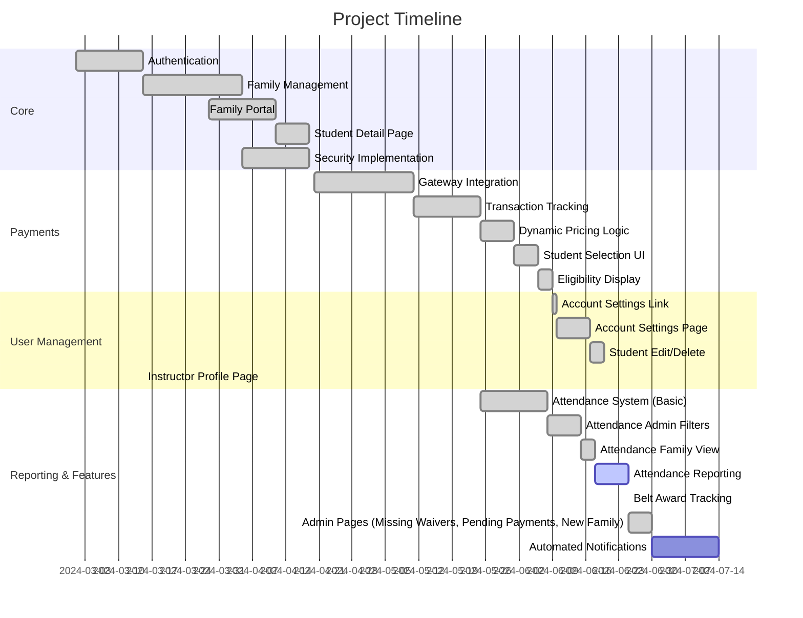

# Karate Class Website

## Project Overview

Develop a comprehensive and user-friendly karate class management website for 
Sensei Negin's classes (details managed in `app/config/site.ts`), 
incorporating efficient family-oriented registration, 
achievement tracking, attendance monitoring, payment integration, and waiver management.

## Website Functionality

### User-facing Features:

- Home Page:

    - Introduction to karate emphasizing personal growth and defense techniques.
    - Class schedule and location details (see `app/config/site.ts`).

- Instructor Profile:

  - Comprehensive bio for Sensei Negin detailing certifications and achievements.

- Registration and Family Management:

    - Family-centric registration allowing multiple children per family.
    - Secure login and family account management.
    - Detailed input fields for family information, guardian(s), and student details.

- Attendance and Achievement Tracking:

    - Automated attendance tracking system.
    - Real-time reporting to identify absentees.
    - Achievement logging for each student to track progress and milestones.

- Payment Integration:

  - Linking parent payments directly to individual children, accommodating multiple children per family.
  - Secure payment processing with transaction records for families.
  - Pricing Structure: Free Trial, $49/1st mo, $100/2nd mo, $121/monthly ongoing (details in `app/config/site.ts`).
  - **Dynamic Tier Calculation:** The payment tier for each student (1st Month, 2nd Month, Ongoing) is calculated dynamically on the payment page (`/family/payment`). It checks the count of past *successful* payments linked to the student via the `payments` and `payment_students` tables.
    - 0 past payments -> 1st Month price
    - 1 past payment -> 2nd Month price
    - 2+ past payments -> Ongoing Monthly price
    - This avoids storing a separate "tier" status in the database.
  - **Eligibility Check:** Student eligibility ("Trial", "Active", "Expired") is determined based on the date of their *most recent* successful payment (within the last ~35 days) or if they have zero payment history ("Trial"). This logic is in `app/utils/supabase.server.ts` and displayed in the Family Portal and Admin panels.

- Online Waivers and Policies:

    - Digitally accessible and signable waivers including:
      - Liability Release
      - Code of Conduct
      - Photo/Video consent
      - Payment and Dress Code agreement

### Administrative Features:
- Secure and intuitive admin interface for managing families, students, attendance, payments, and waivers.
- Detailed reporting tools for attendance, financials, and student achievements.
- Notification system for attendance irregularities.

## Technology Stack

- **Frontend**: Remix framework for optimal user experience, server-side rendering, and modern web practices.
- **Backend**: Supabase for scalable database solutions, authentication, and real-time functionalities.
- **UI Library**: Shadcn for clean, modern, and consistent UI components ensuring high usability.
- **Payments**: Stripe or PayPal integration for robust payment processing.
- **Deployment**: Cloud-based deployment solutions (e.g., Vercel or Netlify).

## Development Timeline

- Week 1-2:

    - Project setup, database schema design, and initial configuration.
    - User authentication and basic registration functionalities.

- Week 3-4:
  - Homepage and instructor profile page development.
  - Development of detailed family and student registration forms.
  - Payment integration setup and testing.

- Week 5-6:
    - Attendance and achievement tracking systems implementation.
    - Admin dashboard creation.
    - Additional informational and policy pages setup.

- Week 7:

    - Waivers management system integration.
    - Initial internal testing.

- Week 8:
    - Comprehensive system testing, bug fixes, and user feedback incorporation.
    - Preparation for launch, final security checks, and deployment.

## Project Status

### Implemented Core Features
✅ **Completed Phase 1 & 2**
- Family management system with guardians/children relationships
- Secure authentication/authorization flow (Login, Registration, Email Confirmation, Role-based Redirects)
- **Family Portal** (`/family`) as main user dashboard after login
  - Displays associated family name
  - Lists registered students with links to detail pages
  - Shows status of required waiver signatures
  - Placeholders for Payments and Account Settings
- **Student Detail Page** (`/family/student/:studentId`) displaying student info
- Admin dashboard foundation
- Waiver signing system with digital signatures
- Production-ready security headers (CSP, HSTS)
- Error boundary handling & SSR/Hydration fixes
  - Supabase database integration (Auth, Families, Students, Waivers, Profiles, Attendance)
  - Mobile-optimized responsive layout

🛠 **Recent Additions**
- Dynamic data fetching for Family Portal (Family, Students, Waiver Status)
- Dynamic data fetching for Student Detail Page
- Login page enhancements (Resend confirmation email)
- Payment gateway CSP pre-configuration
- Font optimization with preconnect
- Security audit workflow
- **Admin Panel Enhancements:**
  - Admin Dashboard (`/admin`) with key statistics (Families, Students, Payments, Attendance, Missing Waivers, Pending Payments)
  - Manage Families page (`/admin/families`)
  - Register New Family page (`/admin/families/new`)
  - Manage Students page (`/admin/students`)
  - View/Edit Student page (`/admin/students/:studentId`) with edit functionality
  - Manage Belt Awards page (`/admin/student-belts/:studentId`) with CRUD operations (formerly Achievements)
  - Manage Waivers page (`/admin/waivers`)
  - View/Edit Waiver page (`/admin/waivers/:waiverId`)
  - View Missing Waivers page (`/admin/waivers/missing`)
  - View Pending Payments page (`/admin/payments/pending`)
  - View Attendance History page (`/admin/attendance`) with date/student filters
  - Record Attendance page (`/admin/attendance/record`) with date picker and upsert logic
  - Added unique constraint to `attendance` table for reliable upserts
- **Family Portal Enhancements:**
  - **Account Settings Link**: Added link from Family Portal to `/family/account`.
  - **Account Settings Page**: Implemented editing for Family, Guardian information, and password changes on `/family/account`.
  - **Student Management**: Added Edit/Delete functionality on `/family/student/:studentId`.
  - **Instructor Profile**: Basic instructor profile page available at `/about`.
  - **Family Attendance View**: Parents can view attendance history for their children at `/family/attendance`.
  - **Admin Attendance Reports**: Admins can view attendance summaries and rates at `/admin/attendance/report`.

### Next Priority Features
1. **Automated Notifications**: Set up basic automated notifications (e.g., for attendance, upcoming payments, new waivers). (Next)

### Development Progress


### Technical Health
```json
{
  "Security": {
    "CSP": "active",
    "HSTS": "enabled",
    "Auth": "JWT@2.16.2"
  },
  "Monitoring": {
    "ErrorLogging": "partial",
    "PaymentTracking": "pending"
  }
}
```
